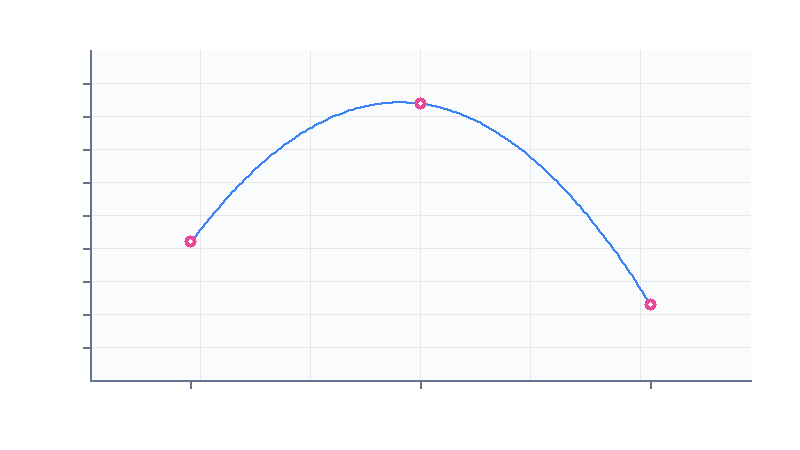
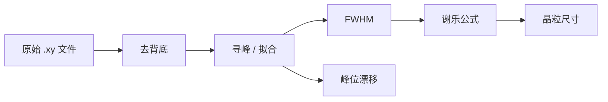

> 这是一篇**示例记录**，作用是演示写作模板和所有可用的排版能力。
> 真正的项目请从「目的与假设」开始写，把这段引用删掉。

## 目的与假设

要验证的问题用一句话写清楚：**沉积速率提高时，薄膜的结晶度是变好还是变差？**

预期是速率过高会让晶粒来不及长大、结晶度下降，所以曲线应该先升后降。
把预期明确写出来的好处是——结果和预期不一致时，你会立刻注意到，而不是
顺手把结论改成「符合预期」。

### 假设的边界

只讨论 200–500 nm 这一厚度区间；更薄的膜表面效应占主导，不在本次范围内。

## 装置与参数

仪器：磁控溅射台（靶材 99.99% Cu）、XRD（Cu Kα，λ = 1.5406 Å）。

| 参数 | 取值 | 说明 |
|---|---|---|
| 本底真空 | 5×10⁻⁴ Pa | 抽到该值后再通Ar |
| 工作气压 | 0.5 Pa | 全程恒定 |
| 溅射功率 | 100 / 150 / 200 W | 自变量 |
| 衬底温度 | 室温 | 不做额外加热 |
| 沉积时间 | 10 min | 保证厚度可比 |

参数表的意义在于**别人能复现**。凡是「差不多」「适当」这类词都要换成数值。

## 步骤

1. 抽真空至 5×10⁻⁴ Pa，通 Ar 至 0.5 Pa，稳定 5 分钟。
2. 按设定功率溅射 10 min，记录起止时间。
3. 取出样品，做 XRD 扫描（2θ = 30°–80°，步长 0.02°）。
4. 用下面的脚本从原始 `.xy` 文件里提取峰位与半高宽。

```python
import numpy as np

def crystallite_size(two_theta, fwhm, wavelength=1.5406):
    """用谢乐公式估算晶粒尺寸（nm）。fwhm 用弧度。"""
    theta = np.radians(two_theta / 2)
    return 0.9 * wavelength / (fwhm * np.cos(theta))


def load_xy(path):
    """读取衍射仪导出的两列文本，跳过以 # 开头的表头。"""
    data = np.loadtxt(path, comments='#')
    return data[:, 0], data[:, 1]
```

> 脚本要连同**输入文件长什么样**一起记下来。半年后你只会记得
> 「有个脚本处理过数据」，不会记得它期望的格式。

## 原始数据

三个功率各测一次，峰位与半高宽汇总如下：

| 功率 (W) | 2θ (°) | FWHM (°) | 估算晶粒尺寸 (nm) |
|---:|---:|---:|---:|
| 100 | 43.31 | 0.62 | 14.2 |
| 150 | 43.29 | 0.48 | 18.4 |
| 200 | 43.35 | 0.71 | 12.3 |



原始文件放在项目目录里一起提交，别只留一张图——图是自己画的，
而原始数据是别人能重新分析的唯一依据。

```text
# 100W.xy
# 2theta  intensity
30.00     112
30.02     118
...
```

## 分析与讨论

处理流程本身很简单，但每一步都要留下中间产物：



150 W 的样品半高宽最小、晶粒最大，与假设一致；200 W 时半高宽反而变大，
说明**功率过高时形核速率过快**，晶粒来不及长大。这一段的判据是
`FWHM(150) < FWHM(100) < FWHM(200)`，恰好对应晶粒尺寸的反序。

需要注意的一个坑：三个样品的厚度并不完全相同（沉积时间相同但速率不同），
所以严格说这不是「只改了一个变量」。下一轮要把厚度也测出来归一化。

## 结论与下一步

- [x] 三个功率的样品全部完成 XRD 扫描
- [x] 建立从原始文件到晶粒尺寸的处理链
- [ ] 补测膜厚，把晶粒尺寸对厚度归一化
- [ ] 增加 175 W 和 225 W 两个点，确认极值位置
- [ ] 换用掠入射 XRD 测更薄的样品

---

**相关链接**：脚本里用到的 `np.loadtxt` 用法见 [NumPy 文档](https://numpy.org/doc/stable/reference/generated/numpy.loadtxt.html)；
谢乐公式的推导可参考 [维基百科](https://en.wikipedia.org/wiki/Scherrer_equation)。
